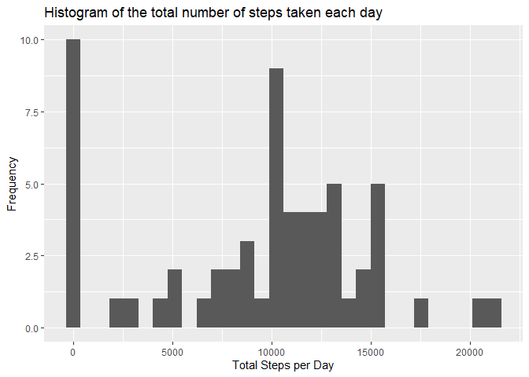
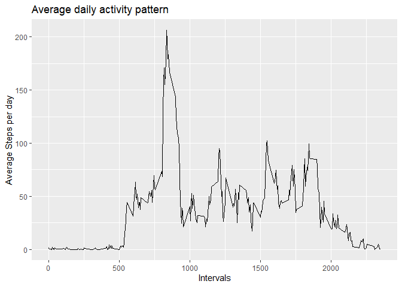
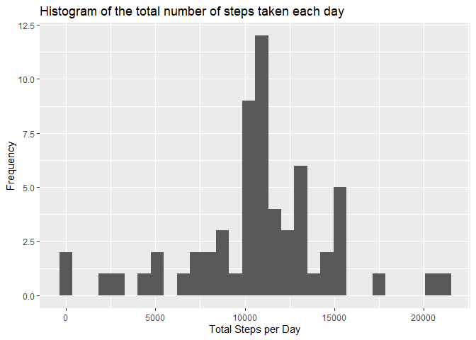
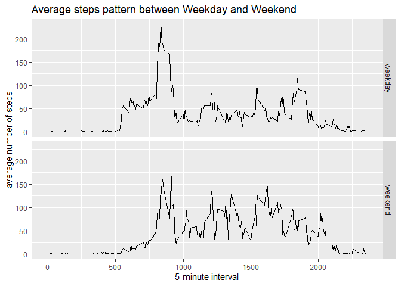

## Loading and preprocessing the data

```r
#loading libraries
library(ggplot2)
library(data.table)
library(readr)
library(ggmosaic)
library(lubridate)
```

```
## 
## Attaching package: 'lubridate'
```

```
## The following objects are masked from 'package:data.table':
## 
##     hour, isoweek, mday, minute, month, quarter, second, wday, week,
##     yday, year
```

```
## The following objects are masked from 'package:base':
## 
##     date, intersect, setdiff, union
```


```r
df <- read.csv("activity/activity.csv", sep = ",", header = TRUE)
```


```r
#summary(df)
df$date <- ymd(df$date)
df$weekend <- as.factor(ifelse(weekdays(df$date) == "Saturday" | weekdays(df$date) == "Sunday", "weekend", "weekday"))
df$dayofweek <- as.factor(weekdays(df$date))
head(df)
```

```
##   steps       date interval weekend dayofweek
## 1    NA 2012-10-01        0 weekday    Monday
## 2    NA 2012-10-01        5 weekday    Monday
## 3    NA 2012-10-01       10 weekday    Monday
## 4    NA 2012-10-01       15 weekday    Monday
## 5    NA 2012-10-01       20 weekday    Monday
## 6    NA 2012-10-01       25 weekday    Monday
```


## What is mean total number of steps taken per day?

```r
library(dplyr)
```

```
## 
## Attaching package: 'dplyr'
```

```
## The following objects are masked from 'package:data.table':
## 
##     between, first, last
```

```
## The following objects are masked from 'package:stats':
## 
##     filter, lag
```

```
## The following objects are masked from 'package:base':
## 
##     intersect, setdiff, setequal, union
```

```r
steps_per_day <- df %>% group_by(date) %>% summarise(stepsperday = sum(steps,na.rm = TRUE))
```

```
## `summarise()` ungrouping output (override with `.groups` argument)
```

```r
qplot(stepsperday, data = steps_per_day, na.rm=TRUE, bins =30,
      xlab = "Total Steps per Day", ylab ="Frequency", main= 'Histogram of the total number of steps taken each day')
```


####Calculate and report the mean and median total number of steps taken per day

```r
meanSteps <- summarise(steps_per_day, meanStep = mean(stepsperday, na.rm = TRUE), 
                       medianStep = median(stepsperday, na.rm = TRUE))
meanSteps
```

```
## Warning: `...` is not empty.
## 
## We detected these problematic arguments:
## * `needs_dots`
## 
## These dots only exist to allow future extensions and should be empty.
## Did you misspecify an argument?
```

```
## # A tibble: 1 x 2
##   meanStep medianStep
##      <dbl>      <int>
## 1    9354.      10395
```


## What is the average daily activity pattern?

```r
interval <- group_by(df, interval)
interval_avg <-  summarise(interval, avg_activity = mean(steps, na.rm = TRUE))
```

```
## `summarise()` ungrouping output (override with `.groups` argument)
```

```r
qplot(interval, avg_activity, data = interval_avg, xlab= "Intervals",
      ylab= "Average Steps per day", main = "Average daily activity pattern", geom ="line")
```

<!-- -->
####Which 5-minute interval, on average across all the days in the dataset, contains the maximum number of steps?

```r
p <- interval_avg[which.max(interval_avg$avg_activity),]
p
```

```
## Warning: `...` is not empty.
## 
## We detected these problematic arguments:
## * `needs_dots`
## 
## These dots only exist to allow future extensions and should be empty.
## Did you misspecify an argument?
```

```
## # A tibble: 1 x 2
##   interval avg_activity
##      <int>        <dbl>
## 1      835         206.
```
interval which has maximum step is 835, 206.1698113


## Imputing missing values


```r
 # subset dataset where there are no NAs
data_no_NA <- df[which(!is.na(df$steps)),]
  
  # calculate the mean steps for each interval
interval_only <- data_no_NA %>% group_by(interval) %>% summarise(average=mean(steps))
```

```
## `summarise()` ungrouping output (override with `.groups` argument)
```

```r
interval_only$average <- as.integer(interval_only$average)
    
#subset dataset where steps have NAs
data_na <- df[which(is.na(df$steps)),]
    
# fill NAs with average steps based on interval
data_na$steps <- ifelse(data_na$interval==interval_only$interval,interval_only$average)
    
# row bind the datasets that do not have NAs and the dataset where NAs are replaced with
# mean values
data_bind <- rbind(data_no_NA,data_na)
```


```r
print(paste0("Number of missing values in data set = ", nrow(data_na)) )
```

```
## [1] "Number of missing values in data set = 2304"
```


```r
# Compute the total number of steps per day
stepsByDay_bind <- data_bind %>% group_by(date) %>% summarise(stepsperday = sum(steps))
```

```
## `summarise()` ungrouping output (override with `.groups` argument)
```

```r
qplot(stepsperday, data = stepsByDay_bind ,  bins =30,
      na.rm = TRUE,
      xlab = "Total Steps per Day", 
      ylab ="Frequency", 
      main= 'Histogram of the total number of steps taken each day')
```

<!-- -->

#### Mean and median number of steps taken each day

```r
meanSteps_bind <- summarise(stepsByDay_bind, meanStep = mean(stepsperday, na.rm = TRUE), 
                       medianStep = median(stepsperday, na.rm = TRUE))
meanSteps_bind
```

```
## Warning: `...` is not empty.
## 
## We detected these problematic arguments:
## * `needs_dots`
## 
## These dots only exist to allow future extensions and should be empty.
## Did you misspecify an argument?
```

```
## # A tibble: 1 x 2
##   meanStep medianStep
##      <dbl>      <int>
## 1   10750.      10641
```


## Are there differences in activity patterns between weekdays and weekends?


```r
meansteps <- data_bind%>% group_by(interval,weekend) %>%   
      summarise(average = mean(steps))
```

```
## `summarise()` regrouping output by 'interval' (override with `.groups` argument)
```

```r
qplot(interval,average,data=meansteps,
      geom="line",
      facets=weekend~.,
      xlab="5-minute interval",
      ylab="average number of steps",
      main="Average steps pattern between Weekday and Weekend")
```

<!-- -->

